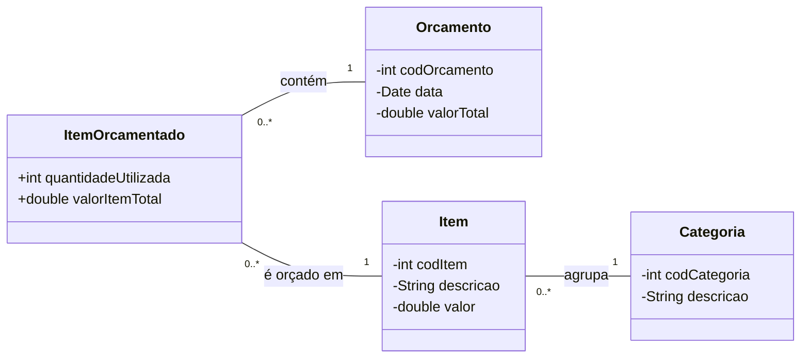

# Pacote Model

## Visão Geral

Este pacote contém todas as classes que representam a estrutura de dados e a lógica de negócio da aplicação **Calculadora de Orçamento de Obras**. Ele é o coração do sistema, responsável por modelar as entidades do mundo real (como itens e categorias) e suas interações, sem qualquer dependência da interface gráfica (View) ou da lógica de controle (Controller).

As classes aqui presentes são projetadas para serem "POJOs" (Plain Old Java Objects), focando em atributos, construtores e métodos de acesso (`getters`/`setters`). Adicionalmente, cada classe inclui um método `toCSV()` para facilitar a exportação de dados, conforme os requisitos do projeto.

---

## Estrutura das Classes

O modelo é composto por quatro classes principais que se relacionam para formar um orçamento.

### 1. `Categoria.java`

-   **Responsabilidade**: Representa uma categoria de custo da obra. Serve para agrupar e classificar os itens.
-   **Atributos**:
    -   `codCategoria` (int): Identificador numérico único para a categoria.
    -   `descricao` (String): Nome da categoria (ex: "Materiais", "Mão de Obra").
-   **Relação**: É a classe base. Uma `Categoria` pode estar associada a vários `Itens`.

### 2. `Item.java`

-   **Responsabilidade**: Modela um produto, serviço ou profissional individual que pode ser cadastrado no sistema. Cada item pertence a uma única categoria.
-   **Atributos**:
    -   `codItem` (int): Código identificador do item.
    -   `descricao` (String): Nome do item (ex: "Cimento", "Eletricista").
    -   `valor` (double): Preço unitário, custo por hora ou salário.
    -   `quantidade` (int): Quantidade disponível em estoque ou número de profissionais.
    -   `categoria` (Categoria): Objeto que estabelece o vínculo com sua respectiva categoria.
-   **Relação**: Um `Item` **pertence a uma** `Categoria`.

### 3. `Orcamento.java`

-   **Responsabilidade**: Representa um orçamento completo e único para uma determinada obra. Funciona como um contêiner para todos os itens selecionados.
-   **Atributos**:
    -   `codOrcamento` (int): Código que identifica unicamente o orçamento.
    -   `data` (Date): Data de criação do orçamento.
    -   `valorTotal` (double): Soma dos custos de todos os itens *antes* da aplicação dos impostos.
    -   `IMPOSTO` (static final double): Constante de `6.5%` para o cálculo do valor final.
-   **Relação**: Um `Orcamento` **pode conter vários** `ItemOrcamentado`.

### 4. `ItemOrcamentado.java`

-   **Responsabilidade**: É a classe de ligação (ou "tabela de junção") entre um `Item` e um `Orcamento`. Ela especifica a quantidade de um `Item` que foi utilizada em um `Orcamento` particular.
-   **Atributos**:
    -   `codItemOrcamentado` (int): Identificador único para este registro específico dentro de um orçamento.
    -   `orcamento` (Orcamento): Referência ao orçamento ao qual este registro pertence.
    -   `item` (Item): Referência ao item do "catálogo" que está sendo utilizado.
    -   `quantidadeUtilizada` (int): A quantidade exata do `item` usada neste `orcamento`.
    -   `valorItemTotal` (double): O subtotal calculado (valor do item × quantidade utilizada).
-   **Relação**: Esta classe conecta um `Item` a um `Orcamento` e define a quantidade.

## Diagrama de Relacionamento (UML)

